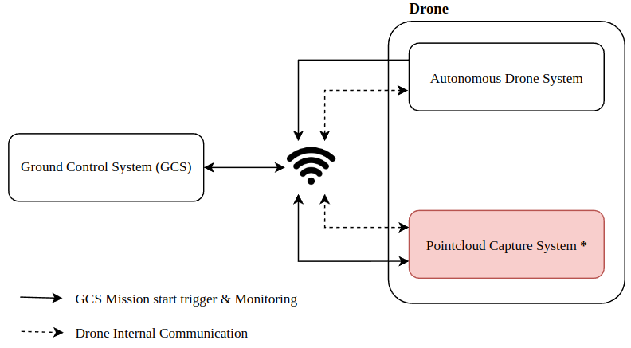
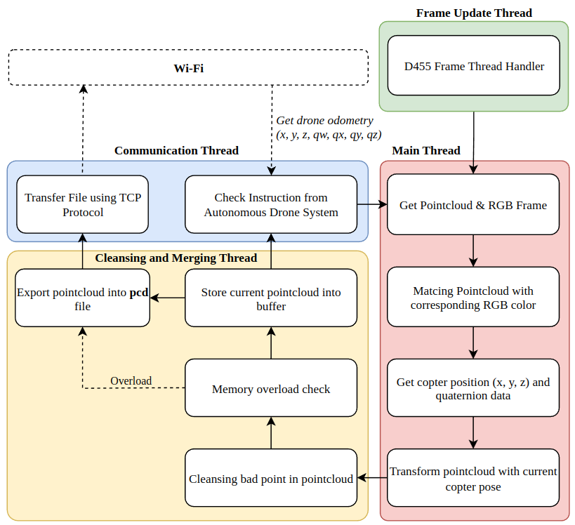

# Pointcloud Capture System

This project is part of my final project for my bachelor's degree, which involves creating an autonomous drone to collect massive amounts of data at a desired target point.

In this project i'm using Intelrealsense Depth Camera (D455) ass pointcloud collector which will triggering from [Autonomous Drone System](https://github.com/Balisa16/UAV-System).


## Requirements
1. Ubuntu >= 18.04
2. CMake >= 3.13 (development test in 3.27.9)
<br>*This program works well in Jetson Nano-Ubuntu 18 with upgraded CMake version aarch.*

## Dependencies
```
git clone https://github.com/IntelRealSense/librealsense.git
cd librealsense
mkdir build && cd build
cmake .. && make -j4
sudo make install
```
### Other
```
sudo apt -y install libpcl-dev libxinerama-dev libxcursor-dev
```

## Build
```
git clone https://github.com/Balisa16/D455.git
cd D455
git submodule update --init --recursive
./prebuild.sh
mkdir build && cd build
cmake .. && make -j$(( $(nproc) - 1 ))
```
